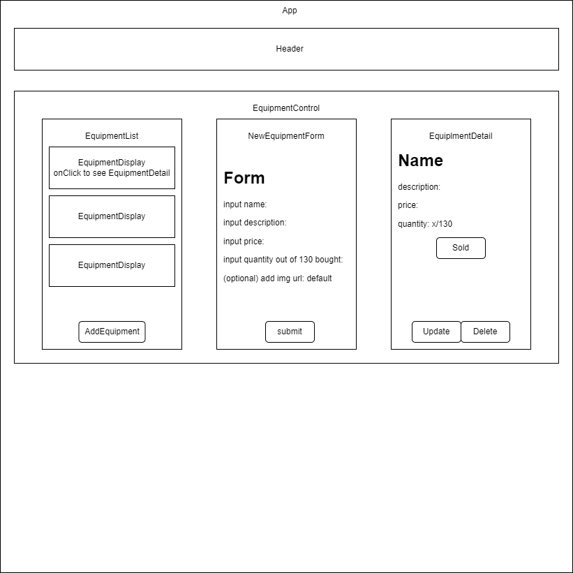

# _Rich Fitness Inventory Tracker_

#### By _**Richard Cha**_

#### _This static web application will allow users to track inventory for a fitness shop_

### <u>Table of Contents</u>
* <a href="#Description">Description</a>
* <a href="#Technologies-Used">Technologies Used</a>
* <a href="#Setup/Installation-Requirements">Setup/Installation Requirements</a>
* <a href="#Known-Bugs">Known Bugs</a>
* <a href="#License">License</a>

## Description

_Rich Fitness Inventory Tracker is a web application that allows users to track inventory for a fitness shop by allowing users to Create, Read, Update, and Delete (CRUD) fitness equipment. Users can also mark any individual equipment as sold by click on that equipment from the list and clicking the "Mark as Sold" button. This will dynamically update the quantity amount._

## Technologies Used

* _JavaScript_
* _React_
* _JSX_
* _HTML_
* _Pico.css_
* _webpack_
* _Node.js_

## Component Diagram

## Setup/Installation Requirements

* _Install Node.js:_
* [OS X and Windows Instructions](https://www.learnhowtoprogram.com/intermediate-javascript/getting-started-with-javascript/installing-node-js)
* _Clone this repo to a local directory_
* _Using Terminal on OS X or PowerShell on Windows: navigate to the directory that this repo was cloned to_
* _Start a development server which will open a locally hosted live version of this Currency Exchange with $ npm run start_

## Known Bugs

* _None_

## License

_If you have any issues or have questions, ideas or concerns please contact me at [charichard09@gmail.com](mailto:charichard09@gmail.com)_

MIT License

Permission is hereby granted, free of charge, to any person obtaining a copy
of this software and associated documentation files (the "Software"), to deal
in the Software without restriction, including without limitation the rights
to use, copy, modify, merge, publish, distribute, sublicense, and/or sell
copies of the Software, and to permit persons to whom the Software is
furnished to do so, subject to the following conditions:

The above copyright notice and this permission notice shall be included in all
copies or substantial portions of the Software.

THE SOFTWARE IS PROVIDED "AS IS", WITHOUT WARRANTY OF ANY KIND, EXPRESS OR
IMPLIED, INCLUDING BUT NOT LIMITED TO THE WARRANTIES OF MERCHANTABILITY,
FITNESS FOR A PARTICULAR PURPOSE AND NONINFRINGEMENT. IN NO EVENT SHALL THE
AUTHORS OR COPYRIGHT HOLDERS BE LIABLE FOR ANY CLAIM, DAMAGES OR OTHER
LIABILITY, WHETHER IN AN ACTION OF CONTRACT, TORT OR OTHERWISE, ARISING FROM,
OUT OF OR IN CONNECTION WITH THE SOFTWARE OR THE USE OR OTHER DEALINGS IN THE
SOFTWARE.

Copyright (c) _2-10-23_ _Richard Cha_